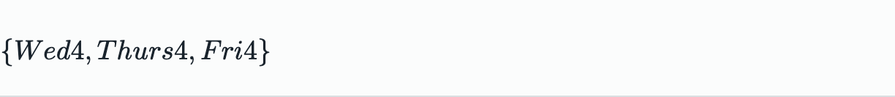
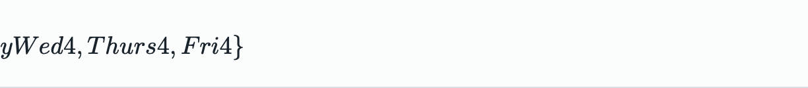
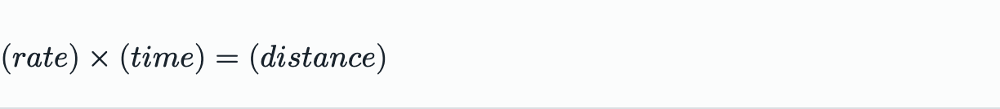

# Rule 19 visual Electron evidence

The Rule 19.2 example was executed in the real offline Electron renderer with
cell-by-cell Nemeth creation, MathJax navigation, exact focused replacement,
undo/redo, and relaunch persistence. The runner also checked one source
MathML root, one MathJax container, non-zero geometry, and zero visual width
for authored source blanks.

Creation screenshot:

Editing screenshot:

The screenshots are review artifacts from the same run as
`/tmp/bana-19-2-visual2.json`. They are not a substitute for BANA cell,
MathML, focus, and persistence assertions, but they make visual spacing and
accidental multi-tree rendering inspectable.

Rule 19.6 creation screenshot:

Rule 19.6 editing screenshot:

This pair comes from `/tmp/bana-19-6-visual.json`. The case passed the full
creation, navigation, focused replacement, Braille, undo/redo, and relaunch
checks. The remaining Rule 19 shard is still open at 19.7.
